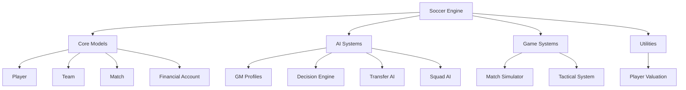
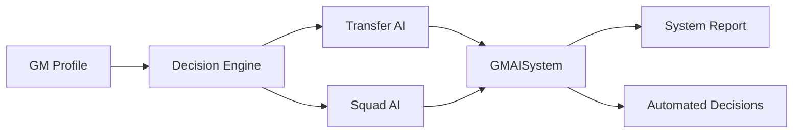

# Soccer Engine Documentation

Welcome to the comprehensive documentation for the Soccer Engine - a sophisticated soccer simulation engine built with Dart/Flutter using Test-Driven Development methodology.

## 🎯 Overview

The Soccer Engine is a complete soccer simulation system featuring advanced AI-driven team management, statistical match simulation, and comprehensive player/team modeling. This documentation provides everything you need to understand, use, and contribute to the project.

## 📚 Documentation Structure

### 🚀 [Developer Onboarding](developer-onboarding/)
Start here if you're new to the project:
- [Getting Started](developer-onboarding/getting-started.md) - Setup, installation, and first steps
- [Development Workflow](developer-onboarding/development-workflow.md) - TDD methodology and testing practices
- [Project Structure](developer-onboarding/project-structure.md) - Codebase organization and conventions
- [Contributing Guide](developer-onboarding/contributing.md) - Contribution guidelines and standards

### 📖 [API Reference](api-reference/)
Complete API documentation for all components:
- [Models](api-reference/models.md) - Player, Team, Match, and all data models
- [AI Systems](api-reference/ai-systems.md) - GM Profiles, Decision Engine, Transfer AI, Squad AI
- [Game Systems](api-reference/game-systems.md) - Match simulation and tactical systems
- [Utilities](api-reference/utilities.md) - Helper functions and utilities

### 🏗️ [Technical Documentation](technical/)
Deep dive into system architecture and design:
- [System Architecture](technical/architecture.md) - Overall system design and components
- [AI Architecture](technical/ai-architecture.md) - Detailed AI system design with flow charts
- [Data Flow](technical/data-flow.md) - How data moves through the system
- [Testing Strategy](technical/testing-strategy.md) - TDD approach and testing methodologies
- [Performance](technical/performance.md) - Performance considerations and benchmarks

## 🎮 Quick Start

```bash
# Clone and setup
git clone https://github.com/srogers909/soccer-engine-dart.git
cd soccer-engine-dart
dart pub get

# Generate JSON serialization
dart run build_runner build

# Run tests
dart test

# Try the demos
dart run bin/demo.dart help
dart run bin/ai_demo.dart
```

## 🎯 Key Features

- **🧠 Smart AI System**: Advanced GM personalities with decision-making capabilities
- **⚽ Match Simulation**: Statistical match engine with weather and tactical factors
- **👥 Team Management**: Complete player, team, and squad management
- **💰 Financial System**: Budget management and Financial Fair Play compliance
- **🌱 Youth Academy**: Youth player development and progression
- **📊 Analytics**: Comprehensive performance tracking and analysis

## 🏗️ System Architecture Overview



## 🤖 AI System Overview

The engine features a sophisticated AI system with multiple personality types:



## 📋 Quick Reference

| Component | Description | Status |
|-----------|-------------|---------|
| Player Model | Complete player attributes and statistics | ✅ Implemented |
| Team Model | Team management and squad organization | ✅ Implemented |
| Match Engine | Statistical match simulation | ✅ Implemented |
| AI Systems | Smart GM decision making | ✅ Implemented |
| Financial System | Budget and FFP management | ✅ Implemented |
| Youth Academy | Youth player development | ✅ Implemented |
| Transfer System | Player transfers and market | ✅ Implemented |

## 🎯 Demo Applications

The engine includes comprehensive demo applications:

- **CLI Demo** (`dart run bin/demo.dart`) - Interactive command-line demonstrations
- **AI Demo** (`dart run bin/ai_demo.dart`) - AI system showcase with different GM personalities

## 📱 Mobile Optimization

Designed and optimized for mobile gaming on Samsung Galaxy S25 Ultra with:
- Efficient memory management
- Optimized performance algorithms
- Battery-conscious processing

## 🤝 Contributing

We welcome contributions! Please see our [Contributing Guide](developer-onboarding/contributing.md) for details on our development process, coding standards, and how to submit contributions.

## 📄 License

This project is licensed under the MIT License - see the [LICENSE](../LICENSE) file for details.

---

**Navigation**: You are here → Documentation Home
