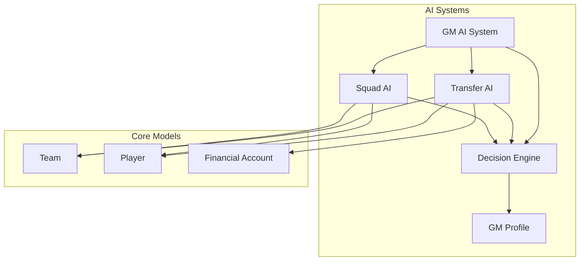

# AI Systems API Reference

[← Back to Documentation](../README.md) | [← Back to API Reference](../README.md#api-reference)

## Overview

The AI Systems module provides intelligent decision-making capabilities for soccer club management. It includes personality-driven GM profiles, a flexible decision engine, and specialized AI systems for transfers and squad management.

## Architecture



---

## GM Profile System

### GMProfile

Represents a general manager's personality profile and decision-making preferences.

#### Constructor

```dart
factory GMProfile({
  required String id,
  required String name,
  required GMPersonality personality,
  double riskTolerance = 0.5,
  double youthFocus = 0.5,
  double tacticalFocus = 0.5,
  double transferBudgetRatio = 0.5,
  double wageBudgetRatio = 0.4,
})
```

#### Properties

| Property | Type | Description |
|----------|------|-------------|
| `id` | `String` | Unique GM identifier |
| `name` | `String` | GM's display name |
| `personality` | `GMPersonality` | GM's personality type |
| `riskTolerance` | `double` | Risk tolerance (0.0-1.0) |
| `youthFocus` | `double` | Youth development focus (0.0-1.0) |
| `tacticalFocus` | `double` | Tactical sophistication (0.0-1.0) |
| `transferBudgetRatio` | `double` | Transfer budget allocation ratio |
| `wageBudgetRatio` | `double` | Wage budget allocation ratio |

#### Preset Constructors

```dart
// Conservative approach - stability focused
GMProfile.conservative({required String id, required String name})

// Aggressive approach - high-risk, high-reward
GMProfile.aggressive({required String id, required String name})

// Youth development specialist
GMProfile.youthFocused({required String id, required String name})

// Tactical mastermind
GMProfile.tactical({required String id, required String name})
```

#### Key Methods

```dart
// Calculate player preference weight
double getPlayerPreferenceWeight({
  required int age,
  required int rating,
  required bool isYouthPlayer,
})

// Calculate transfer urgency weight
double getTransferUrgencyWeight({
  required double squadNeed,
  required double timeRemaining,
})

// Calculate formation preference weight
double getFormationPreferenceWeight({
  required String formation,
  required int availablePlayers,
})

// Generate budget allocation
BudgetAllocation getBudgetAllocation(int totalBudget)
```

#### Example Usage

```dart
// Create an aggressive GM profile
final gm = GMProfile.aggressive(
  id: 'gm_001',
  name: 'Roberto Martinez',
);

// Evaluate a young striker
final preference = gm.getPlayerPreferenceWeight(
  age: 22,
  rating: 78,
  isYouthPlayer: true,
);

// Generate budget allocation for €50M
final allocation = gm.getBudgetAllocation(50000000);
print('Transfer budget: €${allocation.transferBudget / 1000000}M');
```

### GMPersonality Enum

```dart
enum GMPersonality {
  conservative,    // Risk-averse, stability focused
  aggressive,      // High-risk, attacking minded
  balanced,        // Well-rounded approach
  youthFocused,    // Development specialist
  tactical,        // System and tactics focused
}
```

### BudgetAllocation

Budget distribution across different categories.

```dart
class BudgetAllocation {
  final int transferBudget;    // Player acquisitions
  final int wageBudget;        // Player salaries
  final int youthBudget;       // Academy development
  final int facilitiesBudget;  // Infrastructure
}
```

---

## Decision Engine

### DecisionEngine

Core decision-making engine that processes GM personality and context to make informed choices.

#### Constructor

```dart
const DecisionEngine({
  required GMProfile gmProfile,
  bool isEnabled = true,
  List<Decision> decisionHistory = const [],
  int maxHistorySize = 100,
})
```

#### Properties

| Property | Type | Description |
|----------|------|-------------|
| `gmProfile` | `GMProfile` | GM personality profile |
| `isEnabled` | `bool` | Engine operational status |
| `decisionHistory` | `List<Decision>` | Historical decisions |
| `maxHistorySize` | `int` | Maximum history entries |

#### Core Methods

```dart
// Make a decision with context
Decision makeDecision({
  required DecisionType type,
  required List<String> options,
  required Map<String, dynamic> context,
})

// Calculate decision weights
Map<String, double> calculateWeights({
  required DecisionType type,
  required Map<String, dynamic> context,
})

// Engine management
DecisionEngine enable()
DecisionEngine disable()
DecisionEngine clearHistory()
```

#### Example Usage

```dart
final engine = DecisionEngine(gmProfile: conservativeGM);

final decision = engine.makeDecision(
  type: DecisionType.transfer,
  options: ['accept', 'negotiate', 'reject'],
  context: {
    'player_rating': 85,
    'transfer_fee': 25000000,
    'available_budget': 50000000,
    'squad_need_priority': 8,
  },
);

print('Decision: ${decision.selectedOption}');
print('Confidence: ${decision.confidence}');
print('Reasoning: ${decision.reasoning}');
```

### Decision

Represents a decision made by the AI system.

#### Properties

| Property | Type | Description |
|----------|------|-------------|
| `type` | `DecisionType` | Type of decision |
| `selectedOption` | `String` | Chosen option |
| `confidence` | `double` | Decision confidence (0.0-1.0) |
| `reasoning` | `String` | Human-readable explanation |
| `gmProfile` | `GMProfile` | GM who made the decision |
| `context` | `Map<String, dynamic>` | Decision context data |
| `timestamp` | `DateTime` | When decision was made |

### DecisionType Enum

```dart
enum DecisionType {
  transfer,     // Player transfers
  formation,    // Team formation
  lineup,       // Starting XI selection
  tactics,      // Tactical adjustments
  contract,     // Contract negotiations
  budget,       // Budget allocation
  youth,        // Youth development
  training,     // Training programs
  facility,     // Infrastructure investments
}
```

---

## Transfer AI System

### TransferAI

Specialized AI system for managing player transfers and market analysis.

#### Constructor

```dart
const TransferAI({
  required DecisionEngine decisionEngine,
  List<TransferTarget> targets = const [],
  int transferBudget = 0,
  int minRatingThreshold = 70,
  bool isActive = true,
})
```

#### Properties

| Property | Type | Description |
|----------|------|-------------|
| `decisionEngine` | `DecisionEngine` | Core decision engine |
| `targets` | `List<TransferTarget>` | Current transfer targets |
| `transferBudget` | `int` | Available transfer budget |
| `minRatingThreshold` | `int` | Minimum player rating |
| `isActive` | `bool` | System operational status |

#### Core Methods

```dart
// Analyze squad and identify transfer needs
TransferMarketAnalysis analyzeTransferNeeds({
  required Team team,
  required FinancialAccount financialAccount,
  required List<Player> availablePlayers,
})

// Make transfer decision for specific target
Decision makeTransferDecision({
  required TransferTarget target,
  required Team team,
  required FinancialAccount financialAccount,
})

// Evaluate sell opportunities
Decision makeSellDecision({
  required Player player,
  required Team team,
  required int offerAmount,
})
```

#### Example Usage

```dart
final transferAI = TransferAI(
  decisionEngine: engine,
  transferBudget: 30000000,
  minRatingThreshold: 75,
);

// Analyze transfer market
final analysis = transferAI.analyzeTransferNeeds(
  team: myTeam,
  financialAccount: clubFinances,
  availablePlayers: marketPlayers,
);

print('Squad needs: ${analysis.squadNeeds}');
print('Top target: ${analysis.targets.first.player.name}');
print('Strategy: ${analysis.strategy}');

// Make transfer decision
final decision = transferAI.makeTransferDecision(
  target: analysis.targets.first,
  team: myTeam,
  financialAccount: clubFinances,
);
```

### TransferTarget

Information about a potential transfer target.

#### Properties

| Property | Type | Description |
|----------|------|-------------|
| `player` | `Player` | Target player |
| `priority` | `int` | Priority level (1-10) |
| `estimatedFee` | `int` | Estimated transfer fee |
| `maxFee` | `int` | Maximum acceptable fee |
| `need` | `TransferNeed` | Type of squad need |
| `confidence` | `double` | Acquisition confidence |
| `scoutingNotes` | `Map<String, dynamic>` | Additional scouting data |

### TransferMarketAnalysis

Comprehensive transfer market analysis result.

#### Properties

| Property | Type | Description |
|----------|------|-------------|
| `squadNeeds` | `List<TransferNeed>` | Identified squad needs |
| `targets` | `List<TransferTarget>` | Transfer targets |
| `availableBudget` | `int` | Available transfer budget |
| `strategy` | `String` | Recommended strategy |
| `confidence` | `double` | Analysis confidence |
| `timestamp` | `DateTime` | Analysis timestamp |

### TransferNeed Enum

```dart
enum TransferNeed {
  goalkeeper,   // Goalkeeper needed
  defender,     // Defensive reinforcement
  midfielder,   // Midfield strengthening
  forward,      // Attacking options
  backup,       // Squad depth
  youth,        // Young prospects
  star,         // Marquee signing
  depth,        // General squad depth
}
```

---

## Squad AI System

### SquadAI

AI system for squad management, lineup selection, and tactical decisions.

#### Constructor

```dart
const SquadAI({
  required DecisionEngine decisionEngine,
  List<SquadPriority> priorities = const [SquadPriority.balance],
  List<PlayerCondition> playerConditions = const [],
  Formation? preferredFormation,
  bool autoRotation = true,
  int minFitnessThreshold = 75,
})
```

#### Properties

| Property | Type | Description |
|----------|------|-------------|
| `decisionEngine` | `DecisionEngine` | Core decision engine |
| `priorities` | `List<SquadPriority>` | Selection priorities |
| `playerConditions` | `List<PlayerCondition>` | Player fitness/form data |
| `preferredFormation` | `Formation?` | Preferred formation |
| `autoRotation` | `bool` | Auto-rotate based on condition |
| `minFitnessThreshold` | `int` | Minimum fitness for selection |

#### Core Methods

```dart
// Analyze squad and provide recommendations
SquadAnalysis analyzeSquad({
  required Team team,
  required List<PlayerCondition>? conditions,
  SquadPriority? priority,
})

// Make formation decision
Decision makeFormationDecision({
  required Team team,
  required List<Formation> availableFormations,
})

// Make lineup decision
Decision makeLineupDecision({
  required Team team,
  required Formation formation,
  required List<Player> availablePlayers,
})

// Make substitution decision
Decision makeSubstitutionDecision({
  required List<Player> currentLineup,
  required List<Player> bench,
  required Map<String, dynamic> matchContext,
})
```

#### Example Usage

```dart
final squadAI = SquadAI(
  decisionEngine: engine,
  priorities: [SquadPriority.fitness, SquadPriority.form],
  autoRotation: true,
  minFitnessThreshold: 80,
);

// Analyze squad
final analysis = squadAI.analyzeSquad(
  team: myTeam,
  conditions: playerConditions,
  priority: SquadPriority.balance,
);

print('Optimal lineup: ${analysis.optimalLineup.map((p) => p.name)}');
print('Captain: ${analysis.captainRecommendation?.name}');
print('Best formation: ${analysis.formationRecommendations.entries.first.key}');

// Make formation decision
final formationDecision = squadAI.makeFormationDecision(
  team: myTeam,
  availableFormations: Formation.values,
);
```

### SquadAnalysis

Comprehensive squad analysis result.

#### Properties

| Property | Type | Description |
|----------|------|-------------|
| `formationRecommendations` | `Map<Formation, double>` | Formation suitability scores |
| `optimalLineup` | `List<Player>` | Recommended starting XI |
| `benchPlayers` | `List<Player>` | Recommended bench |
| `captainRecommendation` | `Player?` | Recommended captain |
| `balanceScores` | `Map<String, double>` | Squad balance metrics |
| `improvementAreas` | `List<String>` | Areas needing improvement |
| `confidence` | `double` | Analysis confidence |
| `timestamp` | `DateTime` | Analysis timestamp |

### PlayerCondition

Tracks player fitness, form, and readiness.

#### Properties

| Property | Type | Description |
|----------|------|-------------|
| `playerId` | `String` | Player identifier |
| `fitness` | `int` | Fitness level (0-100) |
| `form` | `int` | Current form (0-100) |
| `recentMatches` | `int` | Matches played recently |
| `minutesPlayed` | `int` | Minutes this season |
| `injuryRisk` | `int` | Injury risk level (0-100) |
| `lastPerformance` | `int` | Last match rating |
| `morale` | `int` | Player morale (0-100) |

#### Computed Properties

```dart
double get readinessScore    // Overall readiness (0.0-1.0)
bool get needsRest          // Whether player needs rest
```

### SquadPriority Enum

```dart
enum SquadPriority {
  fitness,      // Prioritize fit players
  form,         // Prioritize in-form players
  chemistry,    // Prioritize team chemistry
  experience,   // Prioritize experienced players
  youth,        // Prioritize young players
  balance,      // Prioritize squad balance
  attack,       // Prioritize attacking strength
  defense,      // Prioritize defensive stability
}
```

---

## GM AI System (Coordinator)

### GMAISystem

Main coordinator that orchestrates all AI subsystems.

#### Constructor

```dart
const GMAISystem({
  required DecisionEngine decisionEngine,
  required TransferAI transferAI,
  required SquadAI squadAI,
  AISystemStatus status = AISystemStatus.active,
  List<AITask> scheduledTasks = const [],
  List<Decision> systemDecisionHistory = const [],
  Map<String, dynamic> configuration = const {},
  bool autoExecute = false,
  double autoExecuteThreshold = 0.8,
})
```

#### Properties

| Property | Type | Description |
|----------|------|-------------|
| `decisionEngine` | `DecisionEngine` | Core decision engine |
| `transferAI` | `TransferAI` | Transfer management AI |
| `squadAI` | `SquadAI` | Squad management AI |
| `status` | `AISystemStatus` | System operational status |
| `scheduledTasks` | `List<AITask>` | Scheduled AI tasks |
| `systemDecisionHistory` | `List<Decision>` | System decision history |
| `configuration` | `Map<String, dynamic>` | System configuration |
| `autoExecute` | `bool` | Auto-execute decisions flag |
| `autoExecuteThreshold` | `double` | Confidence threshold for auto-execution |

#### Core Methods

```dart
// Generate comprehensive system report
AISystemReport generateSystemReport({
  required Team team,
  required FinancialAccount financialAccount,
  required List<Player> availablePlayers,
})

// Make transfer decisions
Decision makeTransferDecision({
  required TransferTarget target,
  required Team team,
  required FinancialAccount financialAccount,
})

// Make squad decisions
Decision makeSquadDecision({
  required Team team,
  required String decisionType,
  required Map<String, dynamic> context,
})

// Task scheduling and execution
GMAISystem scheduleTask(AITask task)
GMAISystem executePendingTasks()

// System management
GMAISystem activate()
GMAISystem deactivate()
GMAISystem enableAutoExecution({double? threshold})
```

#### Example Usage

```dart
final gmAI = GMAISystem(
  decisionEngine: engine,
  transferAI: transferAI,
  squadAI: squadAI,
  autoExecute: false,
);

// Generate comprehensive report
final report = gmAI.generateSystemReport(
  team: myTeam,
  financialAccount: clubFinances,
  availablePlayers: marketPlayers,
);

print('Transfer recommendations: ${report.transferAnalysis?.targets.length}');
print('Squad recommendations: ${report.recommendations}');
print('System confidence: ${report.confidence}');

// Schedule a transfer review task
final task = AITask(
  id: 'transfer_review_001',
  description: 'Review transfer targets for January window',
  priority: DecisionPriority.high,
  scheduledTime: DateTime.now().add(Duration(days: 7)),
  taskType: 'transfer_review',
);

final updatedAI = gmAI.scheduleTask(task);
```

### AISystemReport

Comprehensive system analysis report.

#### Properties

| Property | Type | Description |
|----------|------|-------------|
| `transferAnalysis` | `TransferMarketAnalysis?` | Transfer market analysis |
| `squadAnalysis` | `SquadAnalysis?` | Squad analysis |
| `budgetStatus` | `Map<String, dynamic>` | Budget status overview |
| `recommendations` | `List<String>` | System recommendations |
| `performanceMetrics` | `Map<String, double>` | Performance metrics |
| `timestamp` | `DateTime` | Report timestamp |
| `confidence` | `double` | Overall confidence |

### AITask

Scheduled AI task for future execution.

#### Properties

| Property | Type | Description |
|----------|------|-------------|
| `id` | `String` | Unique task identifier |
| `description` | `String` | Task description |
| `priority` | `DecisionPriority` | Task priority level |
| `scheduledTime` | `DateTime` | Execution time |
| `taskType` | `String` | Task type identifier |
| `parameters` | `Map<String, dynamic>` | Task parameters |
| `isCompleted` | `bool` | Completion status |

---

## Usage Patterns

### Basic AI Setup

```dart
// Create GM profile
final gm = GMProfile.tactical(id: 'gm_001', name: 'Pep Guardiola');

// Create decision engine
final engine = DecisionEngine(gmProfile: gm);

// Create AI systems
final transferAI = TransferAI(
  decisionEngine: engine,
  transferBudget: 50000000,
  minRatingThreshold: 75,
);

final squadAI = SquadAI(
  decisionEngine: engine,
  priorities: [SquadPriority.balance, SquadPriority.fitness],
);

// Create main AI coordinator
final gmAI = GMAISystem(
  decisionEngine: engine,
  transferAI: transferAI,
  squadAI: squadAI,
);
```

### Transfer Window Planning

```dart
// Analyze transfer needs
final analysis = transferAI.analyzeTransferNeeds(
  team: team,
  financialAccount: finances,
  availablePlayers: availablePlayers,
);

// Review top targets
for (final target in analysis.targets.take(3)) {
  final decision = transferAI.makeTransferDecision(
    target: target,
    team: team,
    financialAccount: finances,
  );
  
  if (decision.confidence > 0.8) {
    print('High confidence transfer: ${target.player.name}');
  }
}
```

### Match Day Squad Selection

```dart
// Update player conditions
final conditions = players.map((player) => PlayerCondition(
  playerId: player.id,
  fitness: calculateFitness(player),
  form: calculateForm(player),
  recentMatches: getRecentMatches(player),
  minutesPlayed: getMinutesPlayed(player),
  injuryRisk: calculateInjuryRisk(player),
  lastPerformance: getLastPerformance(player),
  morale: calculateMorale(player),
)).toList();

// Analyze squad with current conditions
final analysis = squadAI.analyzeSquad(
  team: team,
  conditions: conditions,
  priority: SquadPriority.fitness,
);

// Make lineup decision
final lineupDecision = squadAI.makeLineupDecision(
  team: team,
  formation: analysis.formationRecommendations.entries.first.key,
  availablePlayers: team.players,
);
```

---

## Validation Rules

### GMProfile Validation

- `id` and `name` cannot be empty
- All ratio values must be between 0.0 and 1.0
- Focus values (risk, youth, tactical) must be between 0.0 and 1.0

### Decision Context Validation

- Required context keys vary by `DecisionType`
- Numeric values must be within reasonable ranges
- Player references must be valid

### Transfer Target Validation

- `estimatedFee` must be positive
- `maxFee` must be >= `estimatedFee`
- `priority` must be between 1 and 10
- `confidence` must be between 0.0 and 1.0

### Player Condition Validation

- All numeric values must be between 0 and 100
- `minutesPlayed` must be non-negative
- `recentMatches` must be non-negative

---

## Error Handling

### Common Exceptions

```dart
// GM Profile validation
ArgumentError('GM ID cannot be empty')
ArgumentError('Risk tolerance must be between 0.0 and 1.0')

// Decision Engine errors
StateError('DecisionEngine is disabled')
ArgumentError('Options list cannot be empty')

// Transfer AI errors
ArgumentError('Invalid transfer budget')
StateError('Transfer AI is not active')

// Squad AI errors
ArgumentError('Invalid formation requirements')
StateError('Insufficient players for formation')
```

### Error Recovery

```dart
try {
  final decision = engine.makeDecision(
    type: DecisionType.transfer,
    options: options,
    context: context,
  );
} catch (e) {
  // Log error and provide fallback
  logger.error('Decision failed: $e');
  return fallbackDecision;
}
```

---

## Performance Considerations

- **Decision History**: Limit history size to prevent memory issues
- **Player Conditions**: Update conditions incrementally, not all at once
- **Market Analysis**: Cache transfer analyses to avoid repeated calculations
- **Squad Analysis**: Consider formation suitability caching

## Integration Examples

See the [AI Demo](../../bin/ai_demo.dart) for comprehensive usage examples.

---

*This documentation covers the AI Systems API. For game systems, see [Game Systems API Reference](game-systems.md).*
