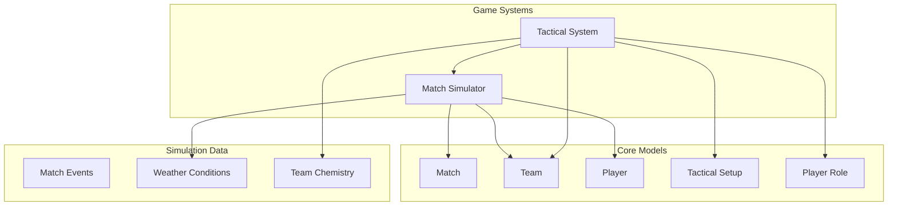

# Game Systems API Reference

[← Back to Documentation](../README.md) | [← Back to API Reference](../README.md#api-reference)

## Overview

The Game Systems module provides the core gameplay mechanics for soccer simulation. It includes match simulation with realistic statistical outcomes, tactical system for team management, and performance calculations based on player attributes and team dynamics.

## Architecture



---

## Match Simulator

### MatchSimulator

Handles soccer match simulation with realistic statistical outcomes based on team strengths, player attributes, and environmental conditions.

#### Constructor

```dart
MatchSimulator({int? seed})
```

- `seed`: Optional random seed for deterministic simulation (useful for testing)

#### Core Methods

```dart
// Simulate complete match with detailed events
Match simulateMatch(Match match)

// Quick simulation for result-only scenarios
Match simulateQuickResult(Match match)
```

#### Example Usage

```dart
final simulator = MatchSimulator();

// Create a match
final match = Match(
  id: 'match_001',
  homeTeam: barcelonaTeam,
  awayTeam: realMadridTeam,
  scheduledDate: DateTime.now(),
  weather: Weather.clear,
  homeAdvantage: 1.1,
);

// Simulate with full events
final fullResult = simulator.simulateMatch(match);
print('Final score: ${fullResult.homeGoals}-${fullResult.awayGoals}');
print('Events: ${fullResult.events.length}');

// Quick simulation for leagues
final quickResult = simulator.simulateQuickResult(match);
print('Quick result: ${quickResult.homeGoals}-${quickResult.awayGoals}');
```

### Simulation Features

#### Detailed Event Simulation

The `simulateMatch` method provides comprehensive match simulation with:

- **Real-time events**: Goals, cards, substitutions with timestamps
- **Player-specific actions**: Individual players involved in events
- **Dynamic probability**: Event likelihood changes based on match state
- **Stoppage time**: Realistic additional time calculation

#### Statistical Realism

Simulation considers multiple factors:

- **Team Strength**: Based on player ratings and team chemistry
- **Home Advantage**: Configurable boost for home teams
- **Weather Conditions**: Performance impact from weather
- **Match Context**: Time-dependent event probabilities

#### Performance Calculation

Team strength calculation includes:

```dart
// Factors affecting team performance
double teamStrength = baseRating 
  * homeAdvantageMultiplier 
  * weatherImpact 
  * chemistryFactor 
  * moraleFactor;
```

### Event Generation

#### Goal Events

Goals are generated based on:
- Team attacking strength vs defensive strength
- Player position preferences (forwards 60%, midfielders 30%, others 10%)
- Match minute intensity (higher in opening/closing periods)

#### Card Events

Card distribution considers:
- Away team slight bias for disciplinary actions
- Player involvement based on position and match intensity
- Separate yellow and red card probabilities

#### Match Flow

```dart
// Event probability calculation
Map<String, double> eventProbabilities = {
  'goal': 0.02 * intensityMultiplier,
  'yellowCard': 0.015 * intensityMultiplier,
  'redCard': 0.002 * intensityMultiplier,
};
```

---

## Tactical System

### TacticalSystem

Manages team tactics, formation setup, and their impact on match performance.

#### Constructor

```dart
TacticalSystem({int? seed})
```

#### Core Methods

```dart
// Create optimal tactical setup for a team
TacticalSetup createDefaultSetup(Team team)

// Generate player roles for formation
List<PlayerRole> createOptimalRoles(Formation formation, List<Player> players)

// Calculate team chemistry based on tactics
double calculateTeamChemistry(Team team, TacticalSetup setup, List<PlayerRole> roles)

// Apply tactical modifiers to performance
Map<String, double> applyTacticalModifiers({
  required TacticalSetup setup,
  required double teamChemistry,
  required int managerRating,
  required bool isHomeTeam,
})

// Suggest tactical adjustments during match
TacticalSetup suggestTacticalAdjustment({
  required TacticalSetup currentSetup,
  required int currentScore,
  required int opponentScore,
  required int minutesRemaining,
  required double currentPossession,
})
```

#### Example Usage

```dart
final tacticalSystem = TacticalSystem();

// Create optimal setup for team
final setup = tacticalSystem.createDefaultSetup(team);
print('Recommended formation: ${setup.formation.displayName}');
print('Attacking mentality: ${setup.attackingMentality}');

// Generate player roles
final roles = tacticalSystem.createOptimalRoles(
  setup.formation,
  team.players,
);

// Calculate chemistry
final chemistry = tacticalSystem.calculateTeamChemistry(
  team,
  setup,
  roles,
);

// Apply performance modifiers
final modifiers = tacticalSystem.applyTacticalModifiers(
  setup: setup,
  teamChemistry: chemistry,
  managerRating: 85,
  isHomeTeam: true,
);

print('Attacking boost: ${modifiers['attacking']}');
print('Defending boost: ${modifiers['defending']}');
```

### Formation Analysis

#### Automatic Setup Generation

The system analyzes team attributes to suggest optimal tactics:

```dart
// Team analysis for formation selection
final avgAttacking = calculateAverageAttacking(team.players);
final avgDefending = calculateAverageDefending(team.players);
final avgTechnical = calculateAverageTechnical(team.players);

// Formation logic
if (avgTechnical >= 90) {
  formation = Formation.f4231; // Technical teams
} else if (avgDefending > avgAttacking + 5) {
  formation = Formation.f532; // Defensive
} else if (avgAttacking > avgDefending + 5) {
  formation = Formation.f343; // Attacking
} else {
  formation = Formation.f442; // Balanced
}
```

#### Formation Characteristics

| Formation | Attacking | Defending | Possession | Best For |
|-----------|-----------|-----------|------------|----------|
| 4-4-2 | 1.0 | 1.0 | 1.0 | Balanced teams |
| 4-3-3 | 1.05 | 0.98 | 1.02 | Attacking teams |
| 3-5-2 | 0.98 | 1.05 | 0.98 | Wing-focused |
| 5-3-2 | 0.95 | 1.1 | 0.95 | Defensive teams |
| 4-5-1 | 0.98 | 1.02 | 1.05 | Possession teams |
| 4-2-3-1 | 1.02 | 1.0 | 1.08 | Technical teams |
| 3-4-3 | 1.1 | 0.9 | 1.05 | Very attacking |
| 4-1-4-1 | 0.95 | 1.05 | 1.08 | Counter-attack |

### Player Role System

#### Position Mapping

The system intelligently maps players to tactical positions:

```dart
// Natural position compatibility
PlayerPosition.defender → [centreBack, leftBack, rightBack, wingBack]
PlayerPosition.midfielder → [defensiveMidfielder, centreMidfielder, 
                           attackingMidfielder, leftWinger, rightWinger]
PlayerPosition.forward → [striker, leftWinger, rightWinger, attackingMidfielder]
PlayerPosition.goalkeeper → [goalkeeper] // Strict mapping
```

#### Role Instructions

Each player role includes tactical instructions:

| Instruction | Range | Description |
|-------------|-------|-------------|
| `attackingFreedom` | 1-100 | How much the player joins attacks |
| `defensiveWork` | 1-100 | Defensive contribution expected |
| `width` | 1-100 | How wide the player should play |
| `creativeFreedom` | 1-100 | License to take creative risks |

#### Example Role Creation

```dart
// Striker role example
PlayerRole strikerRole = PlayerRole(
  position: PlayerPosition.striker,
  attackingFreedom: 90,  // High attacking involvement
  defensiveWork: 20,     // Minimal defensive duties
  width: 60,             // Some width for movement
  creativeFreedom: 70,   // Good creative license
);

// Centre-back role example
PlayerRole centreBackRole = PlayerRole(
  position: PlayerPosition.centreBack,
  attackingFreedom: 20,  // Limited attacking involvement
  defensiveWork: 80,     // High defensive duties
  width: 40,             // Central positioning
  creativeFreedom: 30,   // Conservative play
);
```

### Team Chemistry Calculation

#### Chemistry Factors

Team chemistry is calculated based on:

1. **Position Suitability**: How well players fit their assigned roles
2. **Formation Familiarity**: Bonus for common formations
3. **Role Compatibility**: Match between player attributes and role requirements

#### Chemistry Formula

```dart
double chemistry = (totalRoleSuitability / numberOfPlayers) 
  * 100 
  * formationFamiliarityModifier;

// Position mismatch penalties
if (outOfPosition) {
  suitability *= 0.3; // 70% penalty
}

if (goalkeeperOutOfPosition) {
  suitability *= 0.1; // 90% penalty
}
```

#### Chemistry Impact

- **High Chemistry (80-100)**: +10% to +20% performance boost
- **Average Chemistry (60-79)**: Neutral to +5% boost
- **Poor Chemistry (40-59)**: -5% to -10% penalty
- **Very Poor Chemistry (<40)**: -10% to -20% penalty

### Tactical Modifiers

#### Performance Modifiers

Tactical setup affects team performance in multiple areas:

```dart
Map<String, double> modifiers = {
  'attacking': 0.8 - 1.2,      // ±20% attacking performance
  'defending': 0.8 - 1.2,      // ±20% defending performance
  'possession': 0.85 - 1.15,   // ±15% possession ability
  'chanceCreation': 0.9 - 1.2, // ±10% to +20% chance creation
};
```

#### Mentality Effects

| Mentality | Attacking | Defending | Notes |
|-----------|-----------|-----------|-------|
| Ultra Defensive | 0.8x | 1.2x | All-out defense |
| Defensive | 0.9x | 1.1x | Safety first |
| Balanced | 1.0x | 1.0x | No modifications |
| Attacking | 1.1x | 0.9x | Push forward |
| Ultra Attacking | 1.2x | 0.8x | All-out attack |

#### Style Effects

| Style | Primary Effect | Secondary Effect |
|-------|---------------|------------------|
| Possession | +15% possession | -5% chance creation |
| Counter Attack | +10% chance creation | -10% possession |
| Direct | +5% attacking | -5% possession |
| Wing Play | +5% chance creation | - |

### Dynamic Tactical Adjustments

#### In-Match Adjustments

The system can suggest tactical changes based on match state:

```dart
// Losing late in game
if (isLosing && minutesRemaining < 20) {
  adjustments = {
    'mentality': AttackingMentality.attacking,
    'pressing': currentPressing + 20,
    'tempo': currentTempo + 15,
  };
}

// Winning late in game  
if (isWinning && minutesRemaining < 20) {
  adjustments = {
    'mentality': AttackingMentality.defensive,
    'defensiveLine': currentDefensiveLine - 15,
    'pressing': currentPressing - 10,
  };
}
```

#### Possession-Based Adjustments

```dart
// Low possession adjustments
if (possession < 0.4) {
  adjustments = {
    'style': AttackingStyle.counterAttack,
    'tempo': currentTempo - 10,
  };
}

// High possession adjustments
if (possession > 0.65) {
  adjustments = {
    'style': AttackingStyle.direct,
    'tempo': currentTempo + 10,
  };
}
```

---

## Integration Patterns

### Match Simulation with Tactics

```dart
// Complete match setup with tactics
final tacticalSystem = TacticalSystem();
final simulator = MatchSimulator();

// Set up team tactics
final homeSetup = tacticalSystem.createDefaultSetup(homeTeam);
final awaySetup = tacticalSystem.createDefaultSetup(awayTeam);

// Create roles
final homeRoles = tacticalSystem.createOptimalRoles(
  homeSetup.formation, 
  homeTeam.players
);
final awayRoles = tacticalSystem.createOptimalRoles(
  awaySetup.formation, 
  awayTeam.players
);

// Calculate chemistry
final homeChemistry = tacticalSystem.calculateTeamChemistry(
  homeTeam, homeSetup, homeRoles
);
final awayChemistry = tacticalSystem.calculateTeamChemistry(
  awayTeam, awaySetup, awayRoles
);

// Apply modifiers
final homeModifiers = tacticalSystem.applyTacticalModifiers(
  setup: homeSetup,
  teamChemistry: homeChemistry,
  managerRating: 85,
  isHomeTeam: true,
);

// Update team with tactical bonuses
final enhancedHomeTeam = homeTeam.copyWith(
  overallRating: (homeTeam.overallRating * homeModifiers['attacking']!).round(),
  chemistry: homeChemistry.round(),
);

// Simulate match
final result = simulator.simulateMatch(match.copyWith(
  homeTeam: enhancedHomeTeam,
));
```

### League Simulation

```dart
// Fast simulation for league matches
final simulator = MatchSimulator();
final tacticalSystem = TacticalSystem();

for (final match in leagueMatches) {
  // Apply basic tactical modifiers
  final homeSetup = tacticalSystem.createDefaultSetup(match.homeTeam);
  final awaySetup = tacticalSystem.createDefaultSetup(match.awayTeam);
  
  // Quick result simulation
  final result = simulator.simulateQuickResult(match);
  
  // Update league table
  updateLeagueTable(result);
}
```

### Real-time Match Updates

```dart
// Simulating match with periodic updates
Match currentMatch = initialMatch;
final simulator = MatchSimulator();

// Simulate in chunks (e.g., 15-minute intervals)
for (int period = 0; period < 6; period++) {
  final endMinute = (period + 1) * 15;
  
  // Simulate period
  currentMatch = simulator.simulateMatchPeriod(
    currentMatch, 
    endMinute
  );
  
  // Check for tactical adjustments
  if (shouldAdjustTactics(currentMatch)) {
    final adjustedSetup = tacticalSystem.suggestTacticalAdjustment(
      currentSetup: currentSetup,
      currentScore: currentMatch.homeGoals,
      opponentScore: currentMatch.awayGoals,
      minutesRemaining: 90 - endMinute,
      currentPossession: calculatePossession(currentMatch),
    );
    
    // Apply new setup
    currentSetup = adjustedSetup;
  }
  
  // Update UI/listeners
  notifyMatchUpdate(currentMatch);
}
```

---

## Performance Considerations

### Simulation Speed

- **Full Simulation**: Use for important matches requiring detailed events
- **Quick Simulation**: Use for league processing and background matches
- **Batch Processing**: Process multiple matches in parallel for league updates

### Memory Management

- **Event Limiting**: Consider limiting events stored for completed matches
- **Role Caching**: Cache calculated player roles for repeated use
- **Setup Precomputation**: Pre-calculate tactical setups for teams

### Tactical Optimization

- **Formation Analysis**: Cache formation analysis results
- **Chemistry Calculation**: Optimize chemistry calculation for large squads
- **Modifier Application**: Batch apply modifiers for multiple calculations

---

## Validation Rules

### Match Simulation

- Match must not already be completed
- Teams must have minimum required players
- Weather conditions must be valid
- Home advantage must be positive value

### Tactical Setup

- Formation must have valid position requirements
- Player roles must match formation positions
- Tactical values must be within 1-100 range
- Team must have minimum players for formation

### Chemistry Calculation

- All players must have assigned roles
- Role positions must be valid for formation
- Player attributes must be within valid ranges

---

## Error Handling

### Common Exceptions

```dart
// Match simulation errors
ArgumentError('Cannot simulate an already completed match')
StateError('Insufficient players for simulation')
ArgumentError('Invalid weather conditions')

// Tactical system errors
ArgumentError('Formation requires minimum players')
StateError('Invalid tactical setup')
ArgumentError('Player role mismatch')

// Chemistry calculation errors
ArgumentError('Mismatched players and roles count')
StateError('Invalid formation for chemistry calculation')
```

### Error Recovery

```dart
try {
  final result = simulator.simulateMatch(match);
} catch (e) {
  // Fallback to quick simulation
  logger.warning('Full simulation failed: $e');
  final quickResult = simulator.simulateQuickResult(match);
  return quickResult;
}
```

---

## Testing Support

### Deterministic Simulation

```dart
// Create simulator with fixed seed for testing
final simulator = MatchSimulator(seed: 12345);
final tacticalSystem = TacticalSystem(seed: 12345);

// Results will be consistent across test runs
final result = simulator.simulateMatch(testMatch);
assert(result.homeGoals == expectedHomeGoals);
```

### Performance Testing

```dart
// Benchmark simulation performance
final stopwatch = Stopwatch()..start();

for (int i = 0; i < 1000; i++) {
  simulator.simulateQuickResult(testMatch);
}

final avgTime = stopwatch.elapsedMicroseconds / 1000;
print('Average simulation time: ${avgTime}μs');
```

---

## Integration Examples

See the [Main Demo](../../bin/demo.dart) for comprehensive game system usage examples.

---

*This documentation covers the Game Systems API. For AI systems, see [AI Systems API Reference](ai-systems.md).*
