# Development Workflow

[← Back to Documentation Home](../README.md)

This guide outlines the Test-Driven Development (TDD) methodology and development practices used in the Soccer Engine project.

## 🎯 TDD Philosophy

The Soccer Engine is built using **strict Test-Driven Development** with 100% test coverage. This ensures:
- **Reliability**: Every feature is thoroughly tested
- **Maintainability**: Changes are safe and predictable
- **Documentation**: Tests serve as living documentation
- **Design**: TDD encourages better software design

## 🔄 Red-Green-Refactor Cycle

Every feature follows the classic TDD cycle:

```mermaid
graph LR
    A[🔴 Red] --> B[🟢 Green]
    B --> C[🔵 Refactor]
    C --> A
    
    A1[Write failing test] --> A
    B1[Make test pass] --> B
    C1[Improve code] --> C
```



### 🔴 Red Phase: Write Failing Test

1. **Understand the requirement** - What should the feature do?
2. **Write a failing test** - Test the desired behavior
3. **Run tests** - Confirm the test fails for the right reason

Example:
```dart
// test/models/player_test.dart
test('should update player fitness correctly', () {
  final player = Player(
    id: 'test',
    name: 'Test Player',
    age: 25,
    position: PlayerPosition.midfielder,
    fitness: 80,
  );
  
  final updatedPlayer = player.updateFitness(95);
  
  expect(updatedPlayer.fitness, equals(95));
  expect(updatedPlayer.id, equals('test')); // Should preserve other fields
});
```

### 🟢 Green Phase: Make Test Pass

1. **Write minimal code** - Just enough to make the test pass
2. **No premature optimization** - Focus on correctness first
3. **Run tests** - Confirm the test now passes

Example:
```dart
// lib/src/models/player.dart
class Player {
  // ... existing code
  
  Player updateFitness(int newFitness) {
    final clampedFitness = newFitness.clamp(0, 100);
    return Player(
      id: id,
      name: name,
      age: age,
      position: position,
      technical: technical,
      physical: physical,
      mental: mental,
      form: form,
      fitness: clampedFitness,
    );
  }
}
```

### 🔵 Refactor Phase: Improve Code

1. **Optimize implementation** - Improve performance, readability
2. **Remove duplication** - DRY principle
3. **Maintain test coverage** - Tests must continue to pass

Example:
```dart
// After refactoring - extracted validation logic
Player updateFitness(int newFitness) {
  return _copyWith(fitness: _validateFitness(newFitness));
}

int _validateFitness(int fitness) => fitness.clamp(0, 100);
```

## 🧪 Testing Best Practices

### Test Structure: Arrange-Act-Assert

```dart
test('should calculate position-specific rating for midfielder', () {
  // Arrange - Set up test data
  final player = Player(
    id: 'mid1',
    name: 'Test Midfielder',
    age: 25,
    position: PlayerPosition.midfielder,
    technical: 80,
    physical: 70,
    mental: 85,
  );
  
  // Act - Perform the action
  final rating = player.positionOverallRating;
  
  // Assert - Verify the result
  expect(rating, equals(79)); // technical*0.4 + mental*0.35 + physical*0.25
});
```

### Test Categories

#### Unit Tests
Test individual components in isolation:
```dart
// test/models/player_test.dart
group('Player validation', () {
  test('should throw error for invalid age', () {
    expect(
      () => Player(id: 'p1', name: 'Test', age: 15, position: PlayerPosition.midfielder),
      throwsA(isA<ArgumentError>()),
    );
  });
});
```

#### Integration Tests
Test component interactions:
```dart
// test/systems/match_simulator_test.dart
test('should simulate complete match with realistic results', () {
  final homeTeam = createTestTeam('Home FC');
  final awayTeam = createTestTeam('Away FC');
  
  final match = MatchSimulator.simulate(homeTeam, awayTeam);
  
  expect(match.homeScore, isNonNegative);
  expect(match.awayScore, isNonNegative);
  expect(match.events, isNotEmpty);
});
```

#### Property-Based Tests
Test with random data:
```dart
test('player overall rating should always be between 1 and 100', () {
  for (int i = 0; i < 1000; i++) {
    final player = generateRandomPlayer();
    expect(player.overallRating, inInclusiveRange(1, 100));
  }
});
```

### Test Coverage Requirements

- **Statements**: 100%
- **Functions**: 100%
- **Branches**: 100%
- **Lines**: 100%

Check coverage:
```bash
dart test --coverage=coverage
dart run coverage:format_coverage --lcov --in=coverage --out=coverage/lcov.info --packages=.dart_tool/package_config.json --report-on=lib
```

## 🏗️ Feature Development Workflow

### 1. Planning Phase
```bash
# Create feature branch
git checkout -b feature/player-injury-system

# Plan the API in test form first
# What classes, methods, properties do you need?
```

### 2. Implementation Phase

#### Step 1: Write Tests for New Model
```dart
// test/models/injury_test.dart
import 'package:test/test.dart';
import 'package:soccer_engine/src/models/injury.dart';

void main() {
  group('Injury', () {
    test('should create injury with required fields', () {
      final injury = Injury(
        id: 'inj1',
        playerId: 'p1',
        type: InjuryType.muscle,
        severity: InjurySeverity.minor,
        daysRemaining: 7,
      );
      
      expect(injury.id, equals('inj1'));
      expect(injury.isActive, isTrue);
    });
  });
}
```

#### Step 2: Create Model
```dart
// lib/src/models/injury.dart
import 'package:equatable/equatable.dart';
import 'package:json_annotation/json_annotation.dart';

part 'injury.g.dart';

@JsonEnum()
enum InjuryType { muscle, bone, ligament }

@JsonSerializable()
class Injury extends Equatable {
  final String id;
  final String playerId;
  final InjuryType type;
  final int daysRemaining;
  
  const Injury({
    required this.id,
    required this.playerId,
    required this.type,
    required this.daysRemaining,
  });
  
  bool get isActive => daysRemaining > 0;
  
  factory Injury.fromJson(Map<String, dynamic> json) => _$InjuryFromJson(json);
  Map<String, dynamic> toJson() => _$InjuryToJson(this);
  
  @override
  List<Object?> get props => [id, playerId, type, daysRemaining];
}
```

#### Step 3: Generate JSON Code
```bash
dart run build_runner build
```

#### Step 4: Add to Public API
```dart
// lib/soccer_engine.dart
export 'src/models/injury.dart';
```

#### Step 5: Integration Testing
```dart
// test/models/player_test.dart - Add injury integration
test('should affect player availability when injured', () {
  final player = Player(/* ... */);
  final injury = Injury(/* ... */);
  
  final injuredPlayer = player.addInjury(injury);
  
  expect(injuredPlayer.isAvailable, isFalse);
});
```

### 3. Code Quality Checks

Before committing:
```bash
# Run all tests
dart test

# Check test coverage
dart test --coverage=coverage

# Analyze code
dart analyze

# Format code
dart format .

# Check for dependency issues
dart pub deps
```

## 🚀 Continuous Integration

### Git Workflow

```bash
# 1. Create feature branch
git checkout -b feature/description

# 2. Make changes following TDD
# Write test -> Make it pass -> Refactor

# 3. Commit frequently with good messages
git add .
git commit -m "feat: Add injury system with tests

- Create Injury model with JSON serialization
- Add injury types and severity levels
- Integrate with Player model
- 100% test coverage maintained"

# 4. Push and create PR
git push origin feature/description
```

### Commit Message Format

Follow conventional commits:
- `feat:` - New features
- `fix:` - Bug fixes
- `test:` - Adding tests
- `refactor:` - Code refactoring
- `docs:` - Documentation changes
- `chore:` - Maintenance tasks

### Pre-commit Checklist

- [ ] All tests pass (`dart test`)
- [ ] 100% test coverage maintained
- [ ] No linting errors (`dart analyze`)
- [ ] Code formatted (`dart format .`)
- [ ] JSON generation up to date (`dart run build_runner build`)
- [ ] Public API updated if needed
- [ ] Documentation updated

## 🎯 Performance Considerations

### Benchmarking
Always include performance tests for critical paths:

```dart
// test/benchmarks/player_benchmark_test.dart
test('player creation should be fast enough for game use', () {
  final stopwatch = Stopwatch()..start();
  
  for (int i = 0; i < 10000; i++) {
    Player(
      id: 'p$i',
      name: 'Player $i',
      age: 20 + (i % 15),
      position: PlayerPosition.values[i % 4],
    );
  }
  
  stopwatch.stop();
  
  // Should create 10k players in under 50ms
  expect(stopwatch.elapsedMilliseconds, lessThan(50));
});
```

### Memory Management
Test for memory leaks in long-running simulations:

```dart
test('match simulation should not leak memory', () {
  final initialMemory = ProcessInfo.currentRss;
  
  for (int i = 0; i < 1000; i++) {
    final match = simulateMatch(team1, team2);
    // Force garbage collection
    gc();
  }
  
  final finalMemory = ProcessInfo.currentRss;
  final memoryIncrease = finalMemory - initialMemory;
  
  expect(memoryIncrease, lessThan(10 * 1024 * 1024)); // Less than 10MB increase
});
```

## 🔧 Debugging Tips

### Running Single Tests
```bash
# Run specific test file
dart test test/models/player_test.dart

# Run specific test case
dart test test/models/player_test.dart -n "should calculate overall rating"

# Run with verbose output
dart test --reporter=expanded
```

### Debugging Test Failures
```dart
test('debug example', () {
  final player = Player(/* ... */);
  
  // Add debug prints
  print('Player created: $player');
  print('Overall rating: ${player.overallRating}');
  
  // Use expect with helpful matchers
  expect(player.overallRating, inInclusiveRange(70, 80));
});
```

### JSON Serialization Issues
```bash
# Clean and rebuild generated files
dart run build_runner clean
dart run build_runner build --delete-conflicting-outputs
```

## 📚 Next Steps

- **Project Structure**: Learn about [Project Structure](project-structure.md)
- **Contributing**: Read the [Contributing Guide](contributing.md)
- **API Reference**: Explore the [Models API](../api-reference/models.md)
- **Technical Details**: Dive into [Technical Documentation](../technical/architecture.md)

---

**Navigation**: [Documentation Home](../README.md) → Developer Onboarding → Development Workflow
