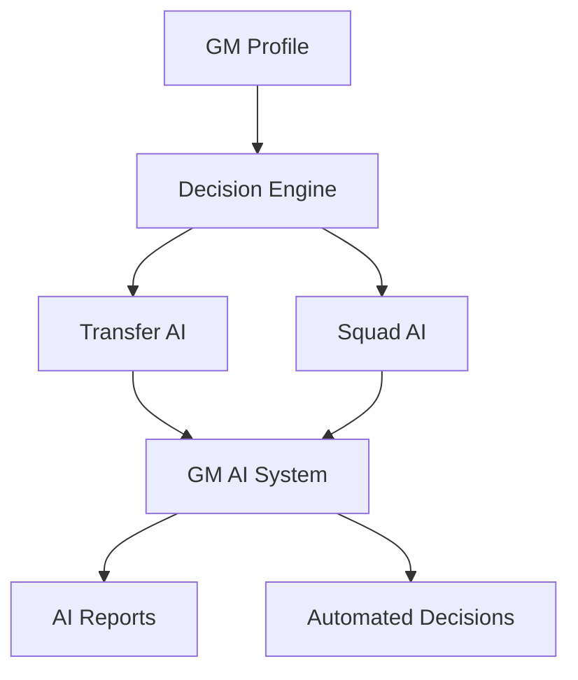
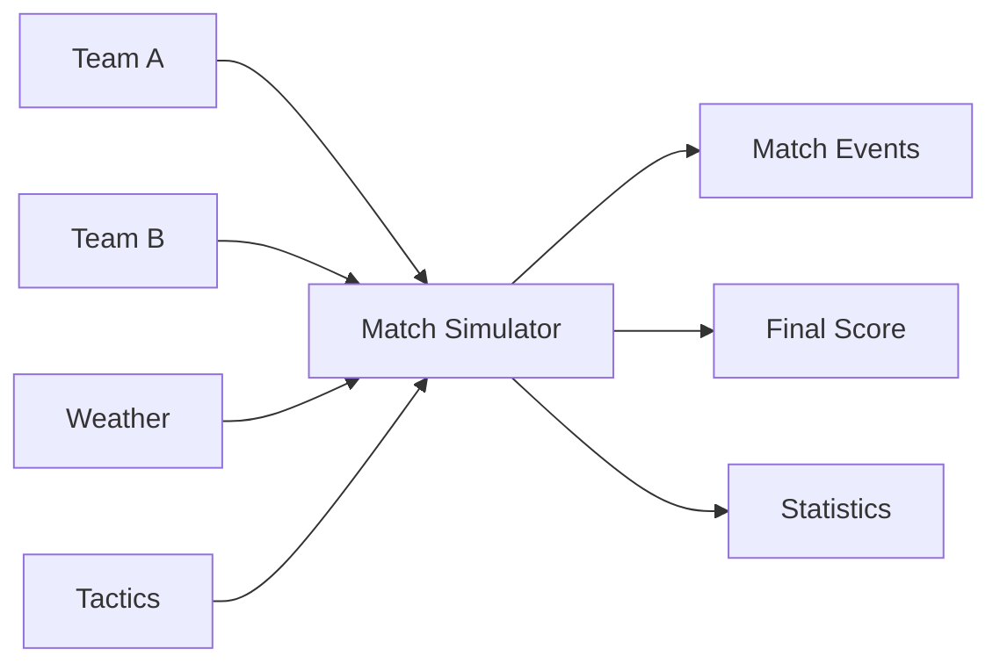

# Project Structure

[← Back to Documentation Home](../README.md)

This guide explains the organization and architecture of the Soccer Engine codebase, helping you understand where to find and place different types of code.

## 📁 High-Level Structure

```
soccer-engine-dart/
├── 📁 lib/                    # Main library code
│   ├── 📄 soccer_engine.dart  # Public API exports
│   └── 📁 src/                # Implementation details
├── 📁 test/                   # Test files (mirrors lib structure)
├── 📁 bin/                    # Executable demos and CLI tools
├── 📁 documentation/          # Project documentation
├── 📁 coverage/               # Test coverage reports
├── 📄 pubspec.yaml           # Project dependencies and metadata
├── 📄 README.md              # Project overview
└── 📄 LICENSE                # MIT license
```

## 🏗️ Library Structure (`lib/`)

### Public API (`lib/soccer_engine.dart`)

The main entry point that exports all public APIs:

```dart
/// Soccer Engine - A comprehensive soccer simulation library
library soccer_engine;

// Core Models
export 'src/models/player.dart' show Player, PlayerPosition;
export 'src/models/team.dart' hide Formation;  // Hide conflicts
export 'src/models/match.dart';
// ... other exports
```

**Key Principles:**
- **Selective Exports**: Only expose what users need
- **Conflict Resolution**: Hide internal enums that conflict
- **Clean API**: Simple imports for library consumers

### Implementation (`lib/src/`)

```
lib/src/
├── 📁 models/          # Data models and entities
├── 📁 ai/             # AI systems and decision engines
├── 📁 systems/        # Game simulation systems
└── 📁 utils/          # Utility functions and helpers
```

## 🗂️ Models Directory (`lib/src/models/`)

Contains all data models and entities:

```
models/
├── 📄 player.dart              # Player model with attributes
├── 📄 team.dart                # Team and squad management
├── 📄 match.dart               # Match data and results
├── 📄 tactics.dart             # Tactical setups and formations
├── 📄 youth_player.dart        # Youth player specialization
├── 📄 youth_academy.dart       # Youth development system
├── 📄 contract.dart            # Player contracts
├── 📄 transfer.dart            # Transfer system
├── 📄 financial_account.dart   # Financial management
└── 📄 *.g.dart                # Generated JSON serialization
```

### Model Design Patterns

#### Immutable Data Structures
```dart
@JsonSerializable()
class Player extends Equatable {
  final String id;
  final String name;
  final int age;
  
  // Immutable constructor
  const Player({required this.id, required this.name, required this.age});
  
  // Update methods return new instances
  Player updateAge(int newAge) {
    return Player(id: id, name: name, age: newAge);
  }
}
```

#### JSON Serialization
```dart
// Always include these for models
part 'player.g.dart';

@JsonSerializable()
class Player extends Equatable {
  // Model definition
  
  factory Player.fromJson(Map<String, dynamic> json) => _$PlayerFromJson(json);
  Map<String, dynamic> toJson() => _$PlayerToJson(this);
}
```

#### Validation
```dart
Player({required this.age, ...}) {
  if (age < 16 || age > 45) {
    throw ArgumentError('Player age must be between 16 and 45');
  }
}
```

## 🤖 AI Directory (`lib/src/ai/`)

Sophisticated AI systems for autonomous game management:

```
ai/
├── 📁 models/
│   └── 📄 gm_profile.dart      # GM personality profiles
├── 📁 engines/
│   └── 📄 decision_engine.dart # Core decision-making engine
├── 📁 systems/
│   ├── 📄 transfer_ai.dart     # Transfer market AI
│   ├── 📄 squad_ai.dart       # Squad management AI
│   └── 📄 gm_ai_system.dart   # Main AI coordinator
├── 📁 analyzers/              # Analysis components (future)
└── 📁 utils/                  # AI utilities (future)
```

### AI Architecture



#### GM Profiles
Define personality-driven decision making:
```dart
enum GMPersonality {
  conservative,    // Risk-averse, proven players
  aggressive,      // High-risk, high-reward
  balanced,        // Moderate approach
  youthFocused,    // Prioritizes young talent
  tactical,        // Formation and tactics focused
}
```

#### Decision Engine
Core decision-making with confidence scoring:
```dart
class Decision {
  final DecisionType type;
  final String selectedOption;
  final double confidence;    // 0.0 to 1.0
  final String reasoning;
  final GMProfile gmProfile;
}
```

## ⚙️ Systems Directory (`lib/src/systems/`)

Game simulation and engine systems:

```
systems/
├── 📄 match_simulator.dart    # Statistical match simulation
├── 📄 tactical_system.dart    # Tactical calculations
└── 📄 (future systems)        # Financial, youth development, etc.
```

### Match Simulation Architecture



## 🛠️ Utils Directory (`lib/src/utils/`)

Utility functions and helper classes:

```
utils/
├── 📄 player_valuation.dart   # Player market value calculations
└── 📄 (future utilities)      # Random generation, name generation, etc.
```

## 🧪 Test Structure (`test/`)

Test files mirror the library structure exactly:

```
test/
├── 📁 models/              # Model tests
│   ├── 📄 player_test.dart
│   ├── 📄 team_test.dart
│   └── 📄 ...
├── 📁 ai/                  # AI system tests
│   ├── 📁 models/
│   ├── 📁 engines/
│   └── 📁 systems/
├── 📁 systems/             # System tests
├── 📁 utils/               # Utility tests
└── 📁 integration/         # Integration tests (future)
```

### Test Organization Principles

#### 1. Mirror Structure
Every `lib/src/` file has a corresponding `test/` file:
```
lib/src/models/player.dart    →    test/models/player_test.dart
lib/src/ai/systems/squad_ai.dart → test/ai/systems/squad_ai_test.dart
```

#### 2. Comprehensive Coverage
Each test file covers:
- **Constructor validation**
- **Method behavior**
- **Edge cases**
- **JSON serialization**
- **Integration points**

#### 3. Test Helpers
```dart
// test/test_helpers.dart
Player createTestPlayer({String? id, String? name}) {
  return Player(
    id: id ?? 'test-player',
    name: name ?? 'Test Player',
    age: 25,
    position: PlayerPosition.midfielder,
  );
}
```

## 🎮 Executables (`bin/`)

Command-line tools and demos:

```
bin/
├── 📄 demo.dart       # Interactive CLI demo
└── 📄 ai_demo.dart    # AI system demonstration
```

### Demo Structure
```dart
void main(List<String> args) {
  if (args.isEmpty) {
    showHelp();
    return;
  }
  
  switch (args[0]) {
    case 'player-demo':
      runPlayerDemo();
      break;
    case 'ai-demo':
      runAIDemo();
      break;
    default:
      showHelp();
  }
}
```

## 📚 Documentation (`documentation/`)

Comprehensive project documentation:

```
documentation/
├── 📄 README.md                    # Main documentation hub
├── 📁 developer-onboarding/       # Getting started guides
├── 📁 api-reference/              # API documentation
└── 📁 technical/                  # Technical deep-dives
```

## 🔧 Configuration Files

### `pubspec.yaml`
Project metadata and dependencies:
```yaml
name: soccer_engine
description: A comprehensive soccer simulation engine
version: 1.0.0

environment:
  sdk: '>=3.0.0 <4.0.0'

dependencies:
  json_annotation: ^4.8.1
  equatable: ^2.0.5

dev_dependencies:
  test: ^1.24.0
  build_runner: ^2.4.0
  json_serializable: ^6.7.1
```

## 🎯 Naming Conventions

### Files and Directories
- **snake_case** for all file and directory names
- **Descriptive names**: `player_test.dart`, not `test1.dart`
- **Consistent suffixes**: `_test.dart`, `_demo.dart`

### Classes and Enums
- **PascalCase** for classes: `Player`, `MatchSimulator`
- **PascalCase** for enums: `PlayerPosition`, `MatchEvent`

### Variables and Functions
- **camelCase** for variables and functions: `overallRating`, `updateFitness()`
- **Descriptive names**: `calculatePositionRating()`, not `calc()`

### Constants
- **lowerCamelCase** for constants: `maxSquadSize`, `minAge`

## 🚀 Import Organization

### Internal Imports
```dart
// 1. Dart core libraries
import 'dart:math';

// 2. Third-party packages
import 'package:json_annotation/json_annotation.dart';
import 'package:equatable/equatable.dart';

// 3. Internal imports (relative paths)
import '../models/player.dart';
import '../utils/validation.dart';
```

### Export Management
```dart
// lib/soccer_engine.dart - Carefully manage public API
export 'src/models/player.dart' show Player, PlayerPosition;
export 'src/models/team.dart' hide Formation;  // Avoid conflicts
```

## 📈 Scalability Considerations

### Future Growth Areas
- **League Management**: Multi-season simulations
- **Advanced AI**: Machine learning integration
- **Multiplayer**: Network protocols for multiplayer leagues
- **UI Integration**: Flutter widget library
- **Data Analytics**: Advanced statistics and reporting

### Modular Design
Each module is designed to be:
- **Independent**: Minimal dependencies between modules
- **Testable**: Comprehensive test coverage
- **Extensible**: Easy to add new features
- **Maintainable**: Clear separation of concerns

## 📚 Next Steps

- **Contributing**: Read the [Contributing Guide](contributing.md)
- **API Reference**: Explore the [Models API](../api-reference/models.md)
- **Technical Details**: Dive into [System Architecture](../technical/architecture.md)

---

**Navigation**: [Documentation Home](../README.md) → Developer Onboarding → Project Structure
