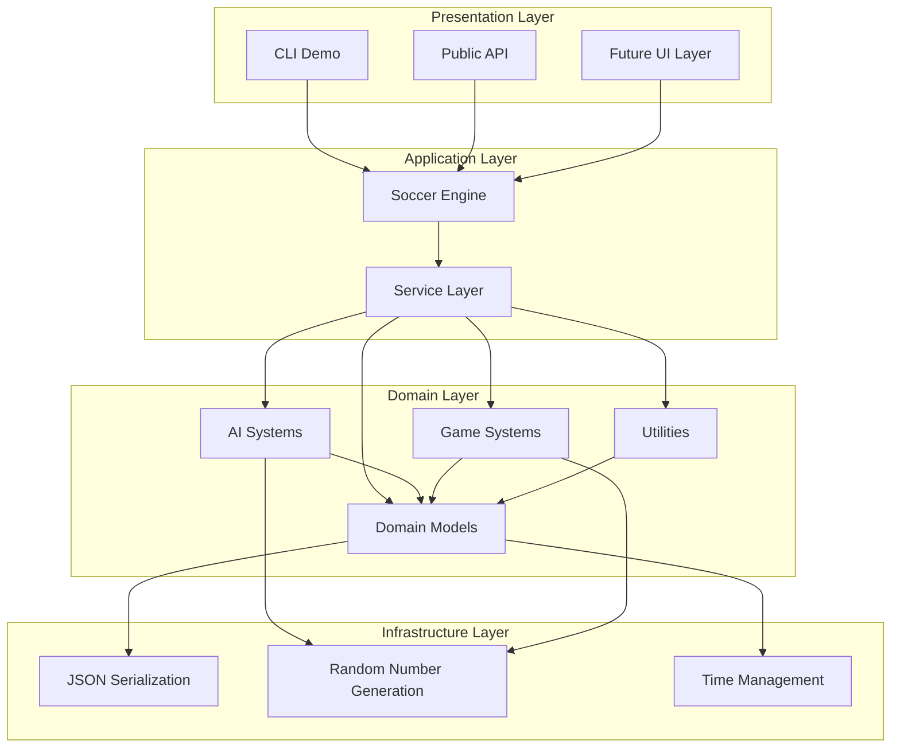
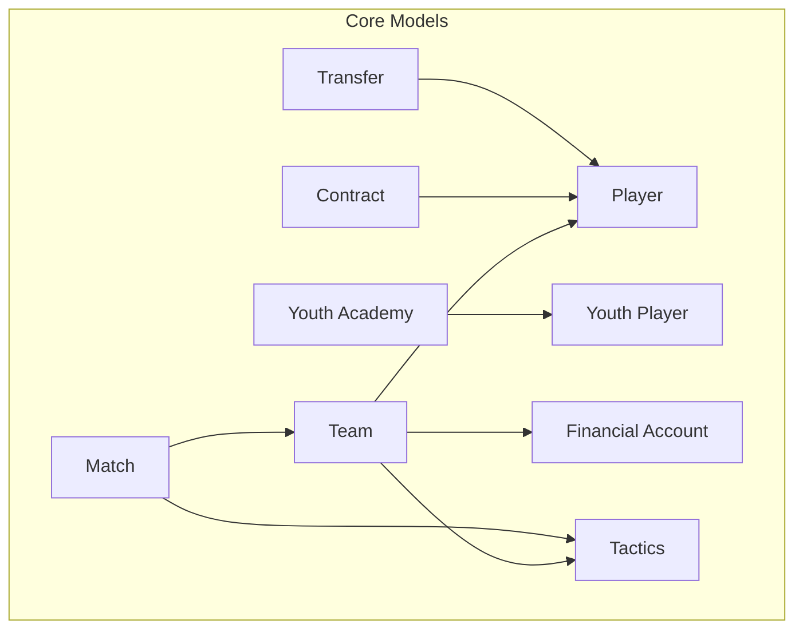
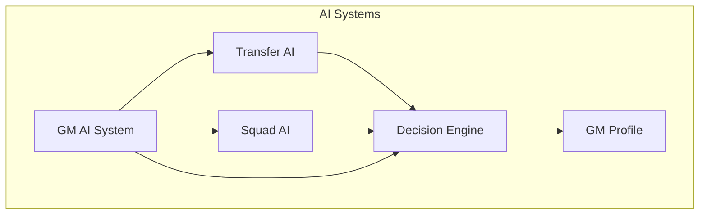
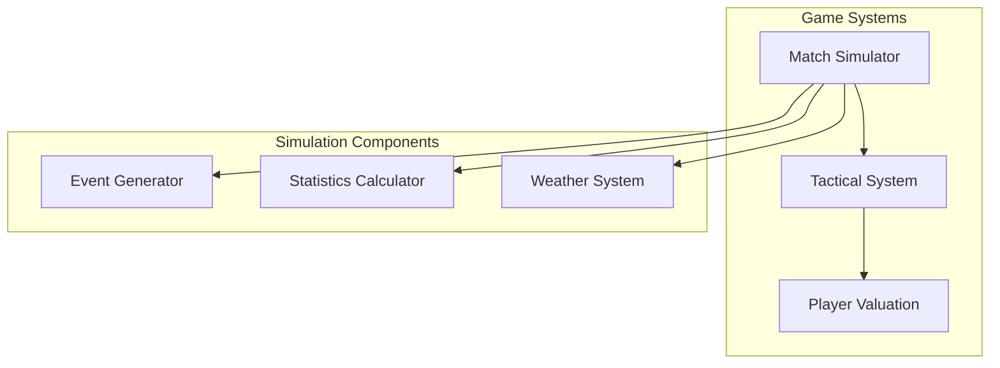
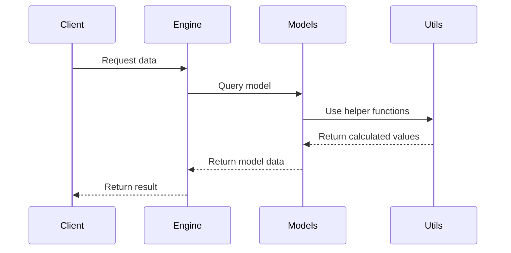
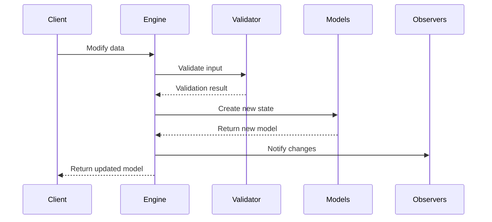
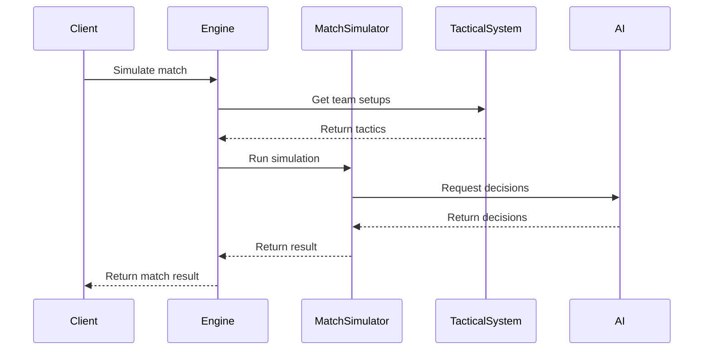

# Architecture Guide

[← Back to Documentation](../README.md) | [← Back to Technical Documentation](../README.md#technical-documentation)

## Overview

The Soccer Engine is built using a layered architecture that separates concerns, promotes testability, and ensures maintainability. This guide covers the architectural decisions, design patterns, and structural organization of the codebase.

## Architecture Principles

### 1. Immutability First

All data models are immutable by design, providing:
- **Thread safety** for concurrent operations
- **Predictable state management** 
- **Easier testing** with deterministic behavior
- **Undo/redo functionality** through state snapshots

```dart
// Immutable data model with copyWith pattern
@JsonSerializable()
class Player extends Equatable {
  final String id;
  final String name;
  final int overallRating;
  
  const Player({
    required this.id,
    required this.name,
    required this.overallRating,
  });
  
  Player copyWith({
    String? id,
    String? name,
    int? overallRating,
  }) {
    return Player(
      id: id ?? this.id,
      name: name ?? this.name,
      overallRating: overallRating ?? this.overallRating,
    );
  }
  
  @override
  List<Object> get props => [id];
}
```

### 2. Test-Driven Development

Every component follows TDD methodology:
- **Red-Green-Refactor** development cycle
- **100% test coverage** requirement
- **Property-based testing** for edge cases
- **Integration tests** for system behavior

### 3. Composition Over Inheritance

The engine favors composition patterns:
- **Mixins** for shared behavior
- **Strategy pattern** for varying algorithms
- **Dependency injection** for flexibility
- **Interface segregation** for focused contracts

### 4. Domain-Driven Design

Code organization reflects soccer domain concepts:
- **Bounded contexts** for different areas (players, matches, AI)
- **Ubiquitous language** using soccer terminology
- **Aggregate roots** for consistency boundaries
- **Value objects** for domain primitives

---

## System Architecture



### Layer Responsibilities

#### Presentation Layer
- **CLI Applications**: Interactive demos and tools
- **Public API**: Clean interface for external consumption
- **Future UI**: Flutter-based user interfaces

#### Application Layer
- **Soccer Engine**: Main orchestration and facade
- **Service Layer**: High-level business operations
- **Workflow Coordination**: Complex multi-step processes

#### Domain Layer
- **Models**: Core business entities and value objects
- **AI Systems**: Intelligent decision-making components
- **Game Systems**: Match simulation and tactical logic
- **Utilities**: Domain-specific helper functions

#### Infrastructure Layer
- **Serialization**: JSON encoding/decoding
- **Random Generation**: Deterministic and non-deterministic RNG
- **Time Management**: Date/time utilities and scheduling

---

## Module Architecture

### Core Models Module

The foundation of the system containing all business entities:



#### Design Patterns Used

**Value Objects**
```dart
// Immutable value object for player attributes
class PlayerAttributes extends Equatable {
  final int technical;
  final int physical;
  final int mental;
  
  const PlayerAttributes({
    required this.technical,
    required this.physical,
    required this.mental,
  });
  
  @override
  List<Object> get props => [technical, physical, mental];
}
```

**Factory Constructors**
```dart
class Player {
  // Main constructor with validation
  factory Player({
    required String id,
    required String name,
    required PlayerPosition position,
    required int overallRating,
  }) {
    _validatePlayer(id, name, overallRating);
    return Player._internal(
      id: id,
      name: name,
      position: position,
      overallRating: overallRating,
    );
  }
  
  // Named constructors for specific scenarios
  factory Player.goalkeeper({
    required String id,
    required String name,
    required int overallRating,
  }) {
    return Player(
      id: id,
      name: name,
      position: PlayerPosition.goalkeeper,
      overallRating: overallRating,
    );
  }
}
```

**Builder Pattern**
```dart
class TeamBuilder {
  String? _id;
  String? _name;
  final List<Player> _players = [];
  Formation _formation = Formation.f442;
  
  TeamBuilder setId(String id) {
    _id = id;
    return this;
  }
  
  TeamBuilder setName(String name) {
    _name = name;
    return this;
  }
  
  TeamBuilder addPlayer(Player player) {
    _players.add(player);
    return this;
  }
  
  TeamBuilder setFormation(Formation formation) {
    _formation = formation;
    return this;
  }
  
  Team build() {
    if (_id == null || _name == null) {
      throw StateError('Team ID and name are required');
    }
    
    return Team(
      id: _id!,
      name: _name!,
      players: List.unmodifiable(_players),
      formation: _formation,
    );
  }
}
```

### AI Systems Module

Intelligent decision-making components with personality-driven behavior:



#### Design Patterns Used

**Strategy Pattern**
```dart
// Different GM personalities use different strategies
abstract class GMStrategy {
  Decision makeTransferDecision(TransferContext context);
  Formation selectFormation(Team team);
}

class AggressiveGMStrategy implements GMStrategy {
  @override
  Decision makeTransferDecision(TransferContext context) {
    // Aggressive transfer logic
    return Decision(
      selectedOption: 'accept',
      confidence: 0.8,
      reasoning: 'Aggressive approach - take the risk',
    );
  }
}

class ConservativeGMStrategy implements GMStrategy {
  @override
  Decision makeTransferDecision(TransferContext context) {
    // Conservative transfer logic
    return Decision(
      selectedOption: 'negotiate',
      confidence: 0.9,
      reasoning: 'Conservative approach - minimize risk',
    );
  }
}
```

**Observer Pattern**
```dart
// AI systems can observe and react to game events
abstract class GameEventObserver {
  void onMatchResult(MatchResult result);
  void onTransferCompleted(Transfer transfer);
  void onPlayerInjury(Player player);
}

class TransferAI implements GameEventObserver {
  @override
  void onMatchResult(MatchResult result) {
    if (result.homeGoals == 0 && result.awayGoals > 2) {
      // Poor performance - consider attacking reinforcements
      _scheduleAttackingReinforcementAnalysis();
    }
  }
  
  @override
  void onPlayerInjury(Player player) {
    if (player.position == PlayerPosition.goalkeeper) {
      // Emergency goalkeeper needed
      _scheduleEmergencyGoalkeeperSearch();
    }
  }
}
```

**Chain of Responsibility**
```dart
// Decision-making pipeline
abstract class DecisionHandler {
  DecisionHandler? _nextHandler;
  
  void setNext(DecisionHandler handler) {
    _nextHandler = handler;
  }
  
  Decision? handle(DecisionRequest request) {
    final result = processRequest(request);
    if (result != null) {
      return result;
    }
    return _nextHandler?.handle(request);
  }
  
  Decision? processRequest(DecisionRequest request);
}

class BudgetDecisionHandler extends DecisionHandler {
  @override
  Decision? processRequest(DecisionRequest request) {
    if (request.type == DecisionType.transfer && 
        request.cost > availableBudget) {
      return Decision(
        selectedOption: 'reject',
        confidence: 1.0,
        reasoning: 'Insufficient budget',
      );
    }
    return null; // Pass to next handler
  }
}
```

### Game Systems Module

Core simulation and tactical management:



#### Design Patterns Used

**Template Method**
```dart
// Match simulation template with customizable steps
abstract class BaseMatchSimulator {
  Match simulateMatch(Match match) {
    final preparedMatch = prepareMatch(match);
    final firstHalf = simulateHalf(preparedMatch, 1);
    final halftimeMatch = processHalftime(firstHalf);
    final secondHalf = simulateHalf(halftimeMatch, 2);
    return finalizeMatch(secondHalf);
  }
  
  // Template methods - can be overridden by subclasses
  Match prepareMatch(Match match) => match;
  Match simulateHalf(Match match, int half);
  Match processHalftime(Match match) => match;
  Match finalizeMatch(Match match) => match;
}

class DetailedMatchSimulator extends BaseMatchSimulator {
  @override
  Match simulateHalf(Match match, int half) {
    // Detailed minute-by-minute simulation
    var currentMatch = match;
    final startMinute = half == 1 ? 1 : 46;
    final endMinute = half == 1 ? 45 : 90;
    
    for (int minute = startMinute; minute <= endMinute; minute++) {
      currentMatch = simulateMinute(currentMatch, minute);
    }
    
    return currentMatch;
  }
}
```

**State Pattern**
```dart
// Match state management
abstract class MatchState {
  void handleEvent(Match match, MatchEvent event);
  bool canAddEvent(MatchEventType type);
}

class ActiveMatchState implements MatchState {
  @override
  void handleEvent(Match match, MatchEvent event) {
    switch (event.type) {
      case MatchEventType.goal:
        _processGoal(match, event);
        break;
      case MatchEventType.redCard:
        _processRedCard(match, event);
        break;
      // ... other events
    }
  }
  
  @override
  bool canAddEvent(MatchEventType type) => true;
}

class CompletedMatchState implements MatchState {
  @override
  void handleEvent(Match match, MatchEvent event) {
    throw StateError('Cannot add events to completed match');
  }
  
  @override
  bool canAddEvent(MatchEventType type) => false;
}
```

---

## Data Flow Architecture

### Read Operations Flow



### Write Operations Flow



### Simulation Flow



---

## Dependency Management

### Dependency Injection

```dart
// Service locator pattern for dependency management
class ServiceLocator {
  static final _instance = ServiceLocator._internal();
  factory ServiceLocator() => _instance;
  ServiceLocator._internal();
  
  final Map<Type, dynamic> _services = {};
  
  void register<T>(T service) {
    _services[T] = service;
  }
  
  T get<T>() {
    final service = _services[T];
    if (service == null) {
      throw StateError('Service of type $T not registered');
    }
    return service as T;
  }
}

// Registration
void setupServices() {
  final locator = ServiceLocator();
  locator.register<Random>(Random());
  locator.register<MatchSimulator>(MatchSimulator());
  locator.register<TacticalSystem>(TacticalSystem());
}

// Usage
class SoccerEngine {
  late final MatchSimulator _simulator;
  late final TacticalSystem _tacticalSystem;
  
  SoccerEngine() {
    final locator = ServiceLocator();
    _simulator = locator.get<MatchSimulator>();
    _tacticalSystem = locator.get<TacticalSystem>();
  }
}
```

### Factory Pattern

```dart
// Abstract factory for creating related objects
abstract class GameFactory {
  Player createPlayer(Map<String, dynamic> data);
  Team createTeam(Map<String, dynamic> data);
  Match createMatch(Map<String, dynamic> data);
}

class DevelopmentGameFactory implements GameFactory {
  @override
  Player createPlayer(Map<String, dynamic> data) {
    return Player.fromJson(data);
  }
  
  @override
  Team createTeam(Map<String, dynamic> data) {
    return Team.fromJson(data);
  }
  
  @override
  Match createMatch(Map<String, dynamic> data) {
    return Match.fromJson(data);
  }
}

class TestGameFactory implements GameFactory {
  @override
  Player createPlayer(Map<String, dynamic> data) {
    // Create test player with deterministic data
    return Player(
      id: data['id'] ?? 'test_player',
      name: data['name'] ?? 'Test Player',
      position: PlayerPosition.forward,
      overallRating: data['rating'] ?? 75,
    );
  }
  
  // ... other methods with test-specific implementations
}
```

---

## Error Handling Architecture

### Exception Hierarchy

```dart
// Base exception for all soccer engine errors
abstract class SoccerEngineException implements Exception {
  final String message;
  final dynamic cause;
  
  const SoccerEngineException(this.message, [this.cause]);
  
  @override
  String toString() => 'SoccerEngineException: $message';
}

// Domain-specific exceptions
class PlayerValidationException extends SoccerEngineException {
  const PlayerValidationException(String message) : super(message);
}

class TeamFormationException extends SoccerEngineException {
  const TeamFormationException(String message) : super(message);
}

class MatchSimulationException extends SoccerEngineException {
  const MatchSimulationException(String message, [dynamic cause]) 
      : super(message, cause);
}
```

### Result Pattern

```dart
// Result type for error handling without exceptions
abstract class Result<T> {
  const Result();
  
  factory Result.success(T value) = Success<T>;
  factory Result.failure(String error) = Failure<T>;
  
  bool get isSuccess => this is Success<T>;
  bool get isFailure => this is Failure<T>;
  
  T get value;
  String get error;
  
  R fold<R>(R Function(T value) onSuccess, R Function(String error) onFailure);
}

class Success<T> extends Result<T> {
  final T _value;
  
  const Success(this._value);
  
  @override
  T get value => _value;
  
  @override
  String get error => throw StateError('Success has no error');
  
  @override
  R fold<R>(R Function(T value) onSuccess, R Function(String error) onFailure) {
    return onSuccess(_value);
  }
}

class Failure<T> extends Result<T> {
  final String _error;
  
  const Failure(this._error);
  
  @override
  T get value => throw StateError('Failure has no value');
  
  @override
  String get error => _error;
  
  @override
  R fold<R>(R Function(T value) onSuccess, R Function(String error) onFailure) {
    return onFailure(_error);
  }
}

// Usage example
Result<Player> createPlayerSafely(Map<String, dynamic> data) {
  try {
    final player = Player.fromJson(data);
    return Result.success(player);
  } on PlayerValidationException catch (e) {
    return Result.failure('Invalid player data: ${e.message}');
  } on FormatException catch (e) {
    return Result.failure('JSON format error: ${e.message}');
  }
}
```

---

## Performance Architecture

### Lazy Loading

```dart
// Lazy computation for expensive operations
class Team {
  final String id;
  final String name;
  final List<Player> players;
  
  // Lazy-loaded computed properties
  late final int _overallRating = _calculateOverallRating();
  late final Map<PlayerPosition, List<Player>> _playersByPosition = 
      _groupPlayersByPosition();
  late final TeamStatistics _statistics = _calculateStatistics();
  
  int get overallRating => _overallRating;
  Map<PlayerPosition, List<Player>> get playersByPosition => _playersByPosition;
  TeamStatistics get statistics => _statistics;
  
  int _calculateOverallRating() {
    // Expensive calculation
    return players.map((p) => p.overallRating).reduce((a, b) => a + b) ~/ 
           players.length;
  }
}
```

### Caching Strategy

```dart
// Simple cache implementation
class CalculationCache<K, V> {
  final Map<K, V> _cache = {};
  final int maxSize;
  
  CalculationCache({this.maxSize = 1000});
  
  V getOrCompute(K key, V Function() compute) {
    if (_cache.containsKey(key)) {
      return _cache[key]!;
    }
    
    final value = compute();
    
    if (_cache.length >= maxSize) {
      // Simple LRU eviction - remove first entry
      _cache.remove(_cache.keys.first);
    }
    
    _cache[key] = value;
    return value;
  }
  
  void invalidate(K key) {
    _cache.remove(key);
  }
  
  void clear() {
    _cache.clear();
  }
}

// Usage in tactical system
class TacticalSystem {
  final CalculationCache<String, double> _chemistryCache = 
      CalculationCache(maxSize: 500);
  
  double calculateTeamChemistry(Team team, TacticalSetup setup) {
    final cacheKey = '${team.id}_${setup.hashCode}';
    
    return _chemistryCache.getOrCompute(cacheKey, () {
      // Expensive chemistry calculation
      return _performChemistryCalculation(team, setup);
    });
  }
}
```

### Memory Management

```dart
// Object pooling for frequently created objects
class MatchEventPool {
  final Queue<MatchEvent> _pool = Queue<MatchEvent>();
  final int maxPoolSize;
  
  MatchEventPool({this.maxPoolSize = 100});
  
  MatchEvent acquire({
    required String id,
    required MatchEventType type,
    required int minute,
    required String teamId,
    required String description,
  }) {
    MatchEvent event;
    
    if (_pool.isNotEmpty) {
      event = _pool.removeFirst();
      // Reset/reinitialize the event
      event = event.copyWith(
        id: id,
        type: type,
        minute: minute,
        teamId: teamId,
        description: description,
      );
    } else {
      event = MatchEvent(
        id: id,
        type: type,
        minute: minute,
        teamId: teamId,
        description: description,
      );
    }
    
    return event;
  }
  
  void release(MatchEvent event) {
    if (_pool.length < maxPoolSize) {
      _pool.add(event);
    }
  }
}
```

---

## Extensibility Architecture

### Plugin System

```dart
// Plugin interface for extending functionality
abstract class SoccerEnginePlugin {
  String get name;
  String get version;
  
  void initialize(SoccerEngine engine);
  void dispose();
}

// Example plugin implementation
class StatisticsPlugin implements SoccerEnginePlugin {
  @override
  String get name => 'Advanced Statistics';
  
  @override
  String get version => '1.0.0';
  
  @override
  void initialize(SoccerEngine engine) {
    // Register event listeners
    engine.onMatchCompleted.listen(_collectMatchStatistics);
    engine.onTransferCompleted.listen(_collectTransferStatistics);
  }
  
  @override
  void dispose() {
    // Clean up resources
  }
  
  void _collectMatchStatistics(Match match) {
    // Collect detailed match statistics
  }
  
  void _collectTransferStatistics(Transfer transfer) {
    // Collect transfer market data
  }
}

// Plugin manager
class PluginManager {
  final List<SoccerEnginePlugin> _plugins = [];
  
  void register(SoccerEnginePlugin plugin) {
    _plugins.add(plugin);
  }
  
  void initializeAll(SoccerEngine engine) {
    for (final plugin in _plugins) {
      plugin.initialize(engine);
    }
  }
  
  void disposeAll() {
    for (final plugin in _plugins) {
      plugin.dispose();
    }
  }
}
```

### Event System

```dart
// Event-driven architecture for loose coupling
class EventBus {
  final Map<Type, List<Function>> _listeners = {};
  
  void on<T>(void Function(T event) listener) {
    _listeners.putIfAbsent(T, () => []).add(listener);
  }
  
  void emit<T>(T event) {
    final listeners = _listeners[T];
    if (listeners != null) {
      for (final listener in listeners) {
        listener(event);
      }
    }
  }
  
  void off<T>(void Function(T event) listener) {
    _listeners[T]?.remove(listener);
  }
}

// Event types
class MatchCompletedEvent {
  final Match match;
  const MatchCompletedEvent(this.match);
}

class PlayerTransferredEvent {
  final Player player;
  final Team fromTeam;
  final Team toTeam;
  const PlayerTransferredEvent(this.player, this.fromTeam, this.toTeam);
}

// Usage
class SoccerEngine {
  final EventBus _eventBus = EventBus();
  
  EventBus get events => _eventBus;
  
  Match simulateMatch(Match match) {
    final result = _simulator.simulateMatch(match);
    _eventBus.emit(MatchCompletedEvent(result));
    return result;
  }
}
```

---

## Testing Architecture

### Test Organization

```
test/
├── models/           # Unit tests for data models
├── systems/          # Tests for game systems
├── ai/              # Tests for AI components
├── utils/           # Tests for utility functions
├── integration/     # Integration tests
├── fixtures/        # Test data and utilities
└── helpers/         # Test helper functions
```

### Test Utilities

```dart
// Test fixture builders
class TestDataBuilder {
  static Player createTestPlayer({
    String? id,
    String? name,
    PlayerPosition? position,
    int? rating,
  }) {
    return Player(
      id: id ?? 'test_player_${DateTime.now().millisecondsSinceEpoch}',
      name: name ?? 'Test Player',
      position: position ?? PlayerPosition.forward,
      overallRating: rating ?? 75,
    );
  }
  
  static Team createTestTeam({
    String? id,
    String? name,
    List<Player>? players,
    Formation? formation,
  }) {
    return Team(
      id: id ?? 'test_team_${DateTime.now().millisecondsSinceEpoch}',
      name: name ?? 'Test Team',
      players: players ?? List.generate(11, (i) => createTestPlayer()),
      formation: formation ?? Formation.f442,
    );
  }
  
  static Match createTestMatch({
    String? id,
    Team? homeTeam,
    Team? awayTeam,
    DateTime? scheduledDate,
  }) {
    return Match(
      id: id ?? 'test_match_${DateTime.now().millisecondsSinceEpoch}',
      homeTeam: homeTeam ?? createTestTeam(),
      awayTeam: awayTeam ?? createTestTeam(),
      scheduledDate: scheduledDate ?? DateTime.now(),
    );
  }
}

// Custom matchers
class MatchesPlayerMatcher extends Matcher {
  final String expectedId;
  final String expectedName;
  
  const MatchesPlayerMatcher(this.expectedId, this.expectedName);
  
  @override
  bool matches(dynamic item, Map matchState) {
    if (item is! Player) return false;
    return item.id == expectedId && item.name == expectedName;
  }
  
  @override
  Description describe(Description description) {
    return description.add('matches player with id $expectedId and name $expectedName');
  }
}

// Usage
Matcher matchesPlayer(String id, String name) => MatchesPlayerMatcher(id, name);

test('creates player correctly', () {
  final player = Player(
    id: 'player_001',
    name: 'Messi',
    position: PlayerPosition.forward,
    overallRating: 95,
  );
  
  expect(player, matchesPlayer('player_001', 'Messi'));
});
```

---

This architecture provides a solid foundation for building scalable, maintainable soccer simulation software while maintaining high code quality and testability standards.
